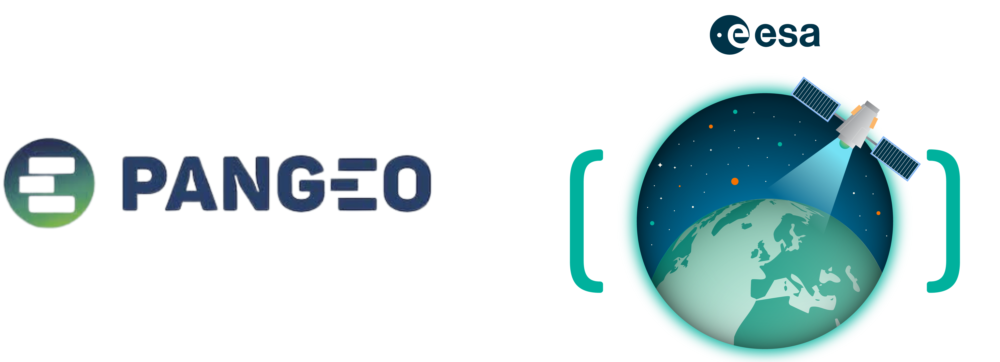

# Welcome to the Pangeo x EarthCODE Workshop!

EarthCODE is a strategic initiative by the <b> European Space Agency (ESA) </b> designed to empower researchers in Earth System Science with FAIR and Open Science practices.

<b>Doing Open Science shouldn't be hard, and EarthCODE makes it easy!</b>

This hands-on workshop is designed to introduce participants to EarthCODE's and the EDC Pangeo Platform's capabilities.

---

## Access a rendered version of this workshop at:

## Form Registration 
Please register your interest by filling in this form: [https://forms.office.com/e/jAB9YLjgY0](https://forms.office.com/e/jAB9YLjgY0) before the session.

